# Relations between modules and contexts

## Flow Chart

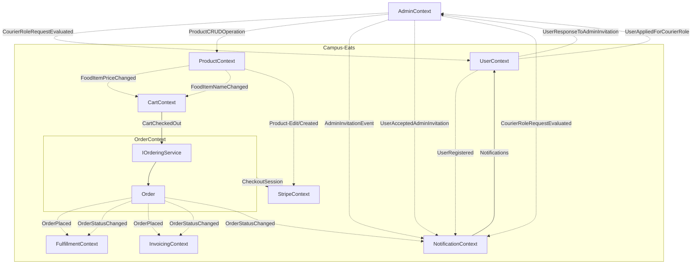

## Contexts

### Admin Context

Admin is created by the system and thereby a default account with name: Admin, and a *secure password* - "Test1234*". The User account has following admin role in ASP.NET - Identity.

The Administrator can invite new users to become an admin, preform CRUD operation on the products, accept or deny courier requests and change delivery fee

Handlers:

* UserAppliedForCourierRoleHandler - Creates courier request
* UserResponseToAdminInvitationHandler - Creates an admin account if users accepts the invitation

Events:

* AdminInvitationEvent - An invite to a trusted user, sent by notification context
* UserAcceptedAdminInvitation - Handled by the notification context
* CourierRoleRequestEvaluated - Handled By user and notification context

#### RetrieveDashBoardData

* Collect all orders from OrderContext
* Gather information about earnings from InvoicingContext

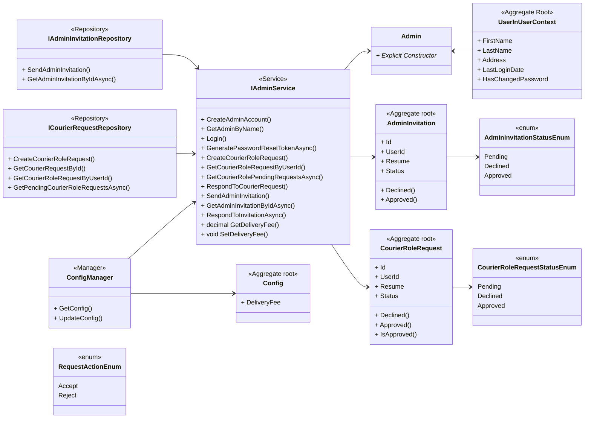

### User Context

A User can be either a costumer or a courier with following role in ASP.NET - Identity. "Customers and couriers should be able to register as a user on our site." - Technical requirement

Github IdentityUser - <https://github.com/aspnet/AspNetIdentity/blob/main/src/Microsoft.AspNet.Identity.EntityFramework/IdentityUser.cs>.

Handlers:

* CourierRoleRequestEvaluatedHandler - Assigns courier role if accepted

Events:

* UserRegistered - Handled by notification context, sends mail to the user
* UserAppliedForCourierRole - Add the request to a list (Handled by a Administrator)
* UserResponseToAdminInvitation - Handled by admin context

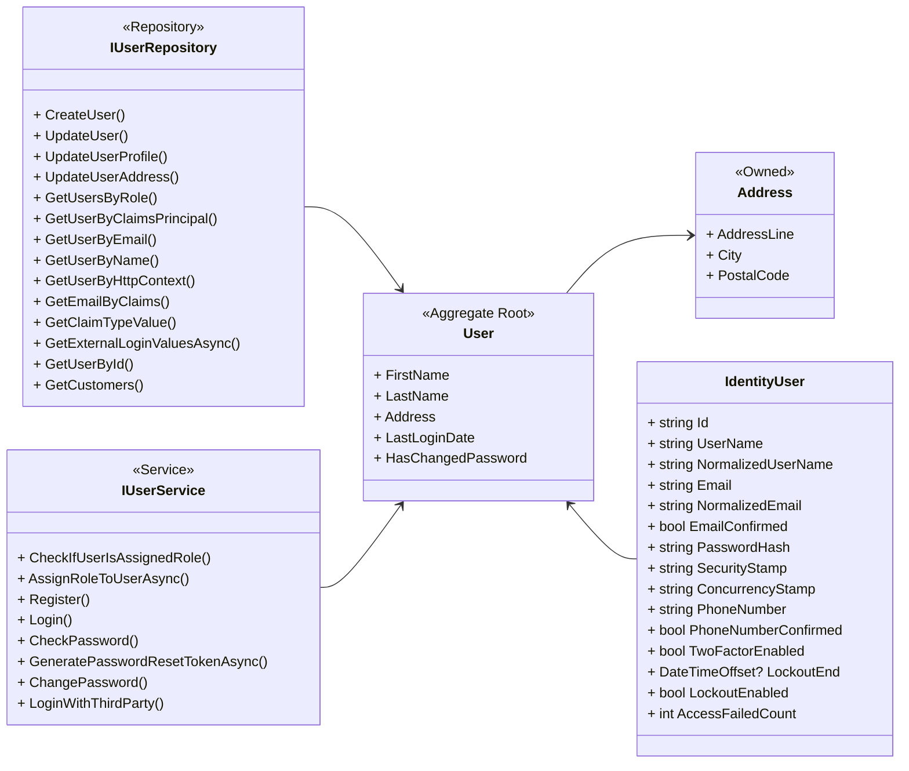

### Product Context

Events:

* FoodItemPriceChanged and FoodItemNameChanged - CartContext updates their items accordingly
* ProductCreated and ProductEdited - Handled by stripe context

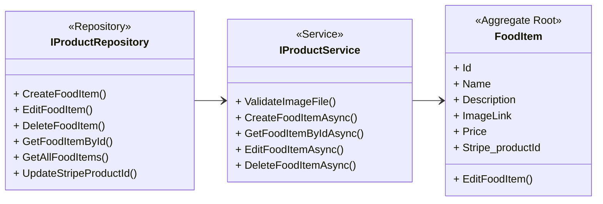

### Cart Context

Events:

* CustomerCheckedOutTheirCart - A custom confirms an order, handled by OrderContext

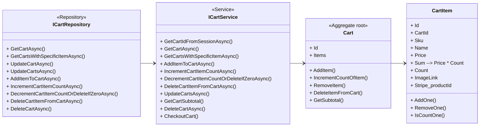

### Ordering Context

Handlers:

* CartCheckedOutHandler - Creates an order with corresponding items from cart

Events:

* OrderPlaced - The Order has been finalized, converted from CartContext data to an Order.
* OrderStatusChanged - Fulfillment, invoicing and notification context handles this event

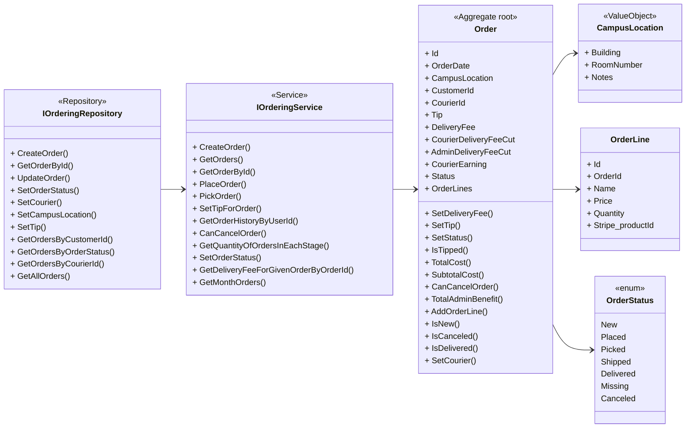

### Fulfillment Context

Handlers:

* InvoicePaidHandler - Makes an offer refundable
* OrderStatusChangedHandler - Creates, refunds and cancels offers depending on the order status
  
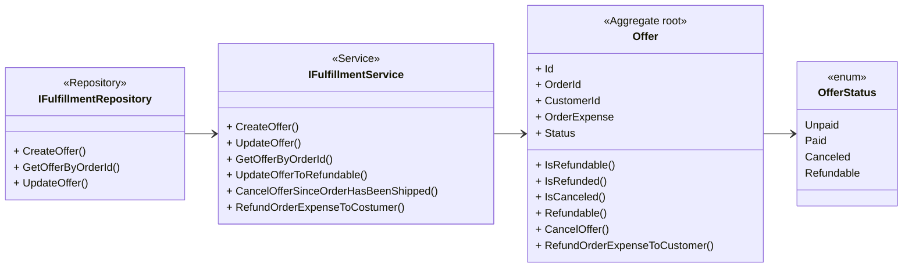

### Invoicing Context

Handlers:

* OrderPlacedHandler - Creates an invoice
* OrderStatusChangedHandler - Credits or removes order expense from payment and keeps the delivery in special case of order canceled and old status was picked.

Events:

* InvoicePaid - Handled by the fulfillment context
  
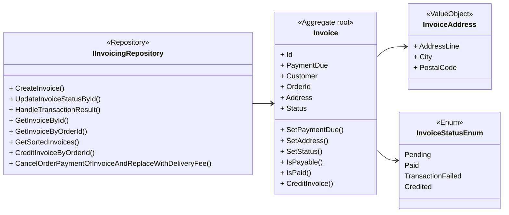

### Notification Context

#### Each email notifications mentioned in the project description

Handlers:

* AdminInvitationHandler - Sends mail, creates notifications, and notifies the user about the invite
* UserRegisteredHandler - Sends mail if Send mail is true and creates a notification
* CourierRequestEvaluatedHandler - Notifies user of admin response
* OrderStatusChangedHandler - Sends messages related to the updated order status
* UserAcceptedAdminInvitationHandler - Notifies the user about the new Admin account

#### Push-notifications

Only push-notification will use the signalR tools, client function: NotifyClient() - Will alert the customer and courier related to an order in real time

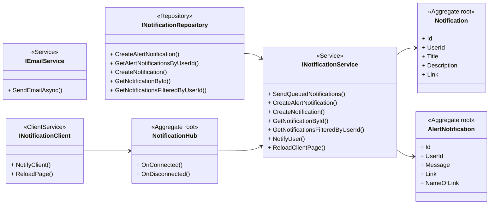

### Stripe Context

Handlers:

* ProductCreatedHandler - Create a corresponding stripe product with the same information
* ProductEditedHandler - Updates the stripe product accordingly

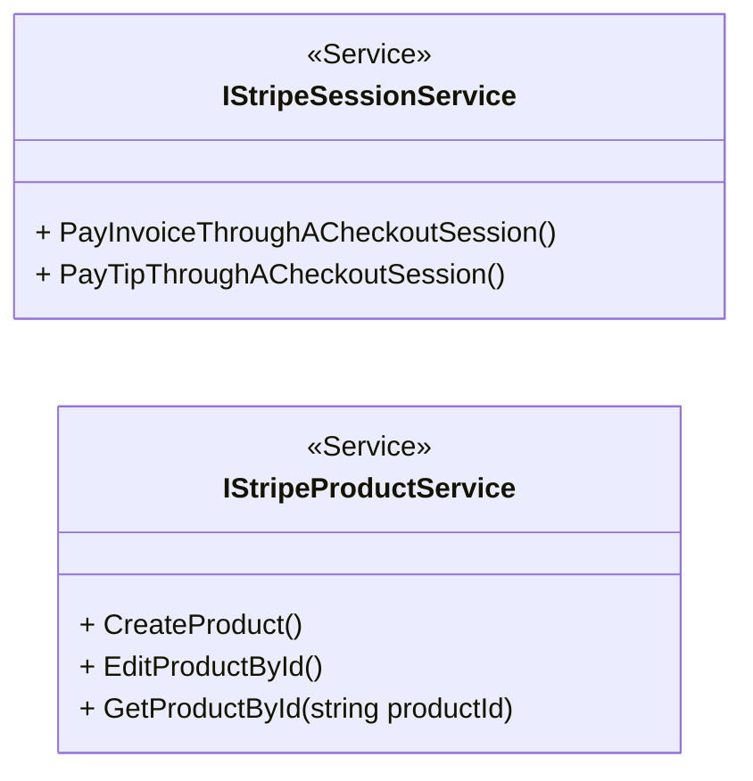

### Generic DB Context

Most of interactions with the database will go through the generic repository.
A repository for each context prevents reuse of code which is optimal. It's about creating as many references to one operation rather than writing it different places in the code, since when you later want to change the logic of the operation its only one area to change.

This repository also allows us to view all the specific interactions with the database from the contexts.

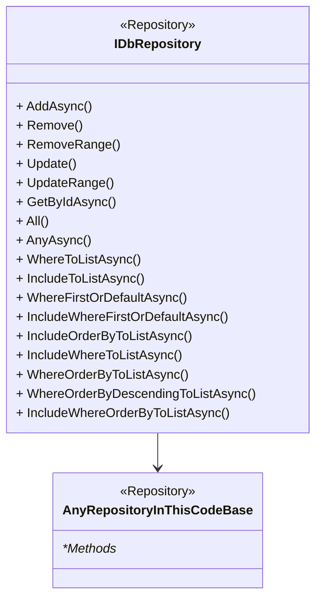
